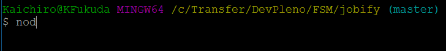

# Jobify
Projeto Jobify - parte do curso Fullstack Master - [DevPleno](https://www.devpleno.com/)

---

## Instruções para instalação

1) Faça o clone deste projeto, conforme comando abaixo...

```sh
git clone https://github.com/kaichiro/jobify.git
```

2) Nevegue até o diretório do projeto...

```sh
cd jobify
```

3) Instale as dependências para o projeto...

```sh
npm install
```

ou (alternativo)...

```sh
yarn
```

4) Comando para rodar/startar o projeto localmente

```sh
node index.js 
```



Acesse este link [http://localhost:3000](http://localhost:3000) para navegar até a aplicação.

## Obs.:

* caso estiver utilizando SO Linux ou iOS, se necessário, acrescente ```sudo``` ao início de cada comando.

---

###### De nada serve o conhecimento se não for compartilhado.
